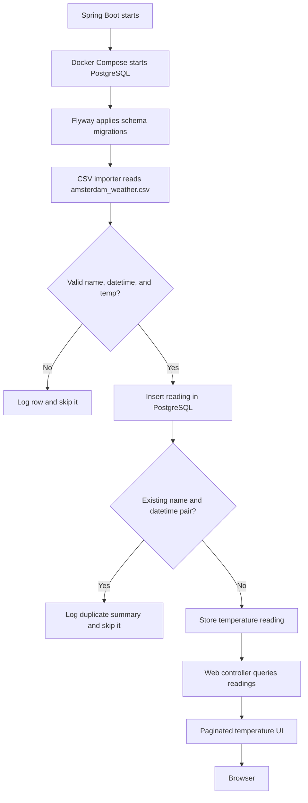

# Amsterdam weather import demo

Run the application from this directory:

```shell
./mvnw spring-boot:run
```

Spring Boot starts the PostgreSQL service defined in `compose.yaml`, Flyway creates
the schema, and the application imports `data/amsterdam_weather.csv`. Re-running
the application is safe: PostgreSQL's `(name, observed_at)` unique constraint
ignores existing readings; the startup log reports the number skipped. Invalid
`name`, `datetime`, or `temp` values are logged and skipped without stopping the
application.

Open http://localhost:8080 to browse the readings. The page shows 50 results at
a time; use the Previous and Next links to paginate.

## Application flow


